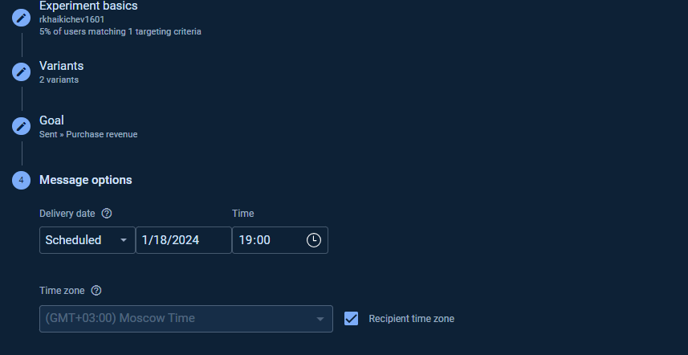
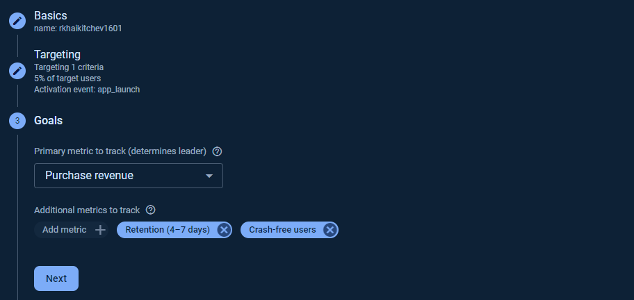

## Task_4. A/B-тестирование мобильных приложений [__Firebase__]([text](https://console.firebase.google.com/))

- ### Создание A/B-теста для Notifications.

> Notifications эксперименты – это эксперименты с push-нотификациями. Например, вы являетесь аналитиком в Delivery Club и хотите протестировать, какой текст лучше отправлять юзерам, чтобы повысить конверсию.

- ### Создание A/B-теста для In-App Messaging.

> Сообщения в приложениях (In-App Messaging) – это отправка целевых контекстных сообщений, которые побуждают юзера выполнить то или иное действие. Например, мы можем отправлять такое сообщение, если видим, что пользователь нашей игры застрял на определенном уровне. Тогда, мы можем протестировать сообщение с подсказкой и решить, какая подсказка лучше помогает юзеру и нашим метрикам. 

- ### Создание A/B-теста для Remote Config.

> Remote Config – это эксперименты на стороне сервера. По своей сути, Remote Config эксперименты очень похожи на Server-side эксперименты в Google Optimize. В случае с Remote Config мы также тестируем разные версии нашего приложения. Например, вы работаете аналитиком в Ситимобил и хотите посмотреть, какой цвет иконки вызова такси даст прирост к конверсии. 

