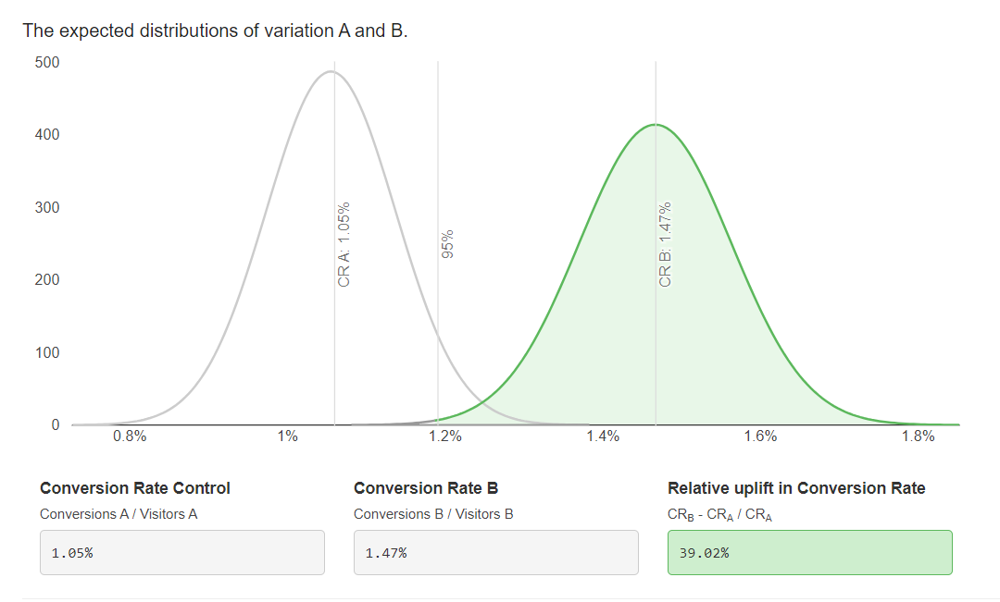

## Task_5. Применение математической статистики для проверки гипотез в реальной жизни для популярных метрик

### Задача 1.
Вы провели эксперимент c упрощением формы заказа в магазине Утконос и получили результаты по метрике конверсий в покупку.
Выберите метод оценки и оцените есть ли стат.значимые различия между конверсиями в двух группах при alpha = 5%.
Дайте краткие рекомендации команде.

Результаты:
1) Число юзеров в группах, которые заходили на сайт в период эксперимента:

n1 = 15550 и n2 = 15550 .
2) Число юзеров в группах , которые совершили хотя бы одну покупку за период эксперимента:

n1 = 164 и n2 = 228
3) Конверсии:

conv1 = 1.05% conv2 = 1.47% .

Калькулятор - [Хи-квадрат](https://www.evanmiller.org/ab-testing/chi-squared.html) на однородность распределения в двух ген совокупностях

Калькулятор - [Z критерий долей](https://abtestguide.com/calc/)

Вывод:

_p-value_ > alpha. Выборки статистически различны. Второй вариант показывает лучший результат. Рекомендация внедрить изменения. 

### Задача 2.
Сравниваем метрику конверсия в покупку. Размер выборки - 10 000 элементов в каждой группе.

Какой статистический критерий тут лучше всего подойдёт и почему?

__Хи-квадрат Пирсона__

Так как:
* Конверсия относится к типу данных - *качественные (раноговые 0-1)*
* Независимые (рандомно взятые пользователи)
* Cравнивается 2 группы

Так как выборка большая, так же подходит __Z-тест__.

<i>
Типы данных:

1. Количественные
    
    * Непрерывные (средний чек, таймспент и тд)
    * Дискретные (число детей, число мотоциклов и тд)

2. Качественные

    * номинативные (пол, названия групп, именна и тд)
    * ранговые (оценка в  психологическом исследовании, оценка асессора итд )

Независимые выборки – это те выборки, в которых вероятность отбора любого респондента одной выборки не зависит от отбора любого из респондентов другой выборки.
Пример: рандомно взятые новые пользователи
</i>

___
> Проверка на нормальность - тест Шапиро-Уилка
 
Если нормальное распределение, то [t-критерий](https://www.evanmiller.org/ab-testing/t-test.html)

Если не нормальное, то [критерий Манна-Уитни](https://ccb-compute2.cs.uni-saarland.de/wtest/)