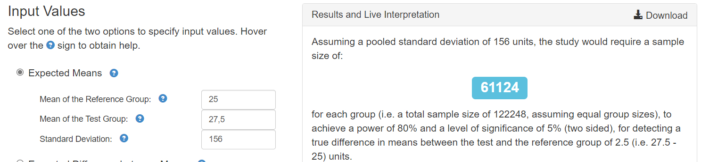
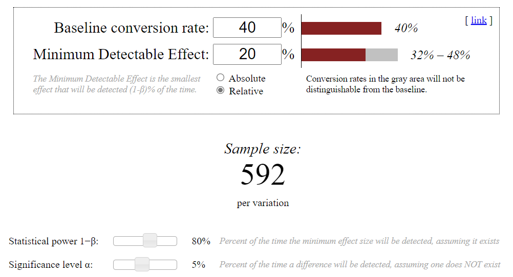

## Task_6. Расчёт длительности А/B теста

**Берем 5% от среднего трафика в день.* 

### Задача 1*
Продакт на главной mail.ru решил протестировать в рекомендательной ленте контента вместо карточек со статьями видеоплеер с короткими видео. Нынешний таймспент на юзера в день в среднем равен 25 минут, а стандартная ошибка (SD) равна 156. Мы предполагаем, что в новой версии таймспент на юзера в день изменится на 10%. Средний трафик 20000 человек в день.

Посчитайте сколько дней необходимо держать эксперимент при alpha = 5% и beta = 20% .

[Sample Size Calculator for Comparing Two Independent Means](https://statulator.com/SampleSize/ss2M.html)

*Options:*
* Desired Power - 0.8
* Level of Significance - 0.05

* 5% от среднего трафика в день (20 000) = 1 000 человек
* Контрольная группа - 61 124
* Тестовая - 61 124
* Всего - 122 248

__Вывод:__ 122 248 / 1 000 ~ 123 дня должен длится тест, если мы его реализуем на 5% от всех пользователей.

### Задача 2*
Наша продуктовая команда в ecommerce магазине планирует запустить тест, направленный на ускорение загрузки сайта. Одна из основных метрик bounce rate в GA = 40%. Мы предполагаем, что при оптимизации сайта она изменится минимум на 20%. Средний трафик 4000 человек в день.

Посчитайте сколько нам нужно дней держать эксперимент при alpha = 5% и beta = 20%

[Sample Size Calculator](https://www.evanmiller.org/ab-testing/sample-size.html)

* 5% от среднего трафика в день (4 000) = 200 человек
* Контрольная группа - 592
* Тестовая - 592
* Всего - 1 184

__Вывод:__ 1 184 / 200 = 5.92 ~ 6 дней должен длится тест, если мы его реализуем на 5% от всех пользователей.
